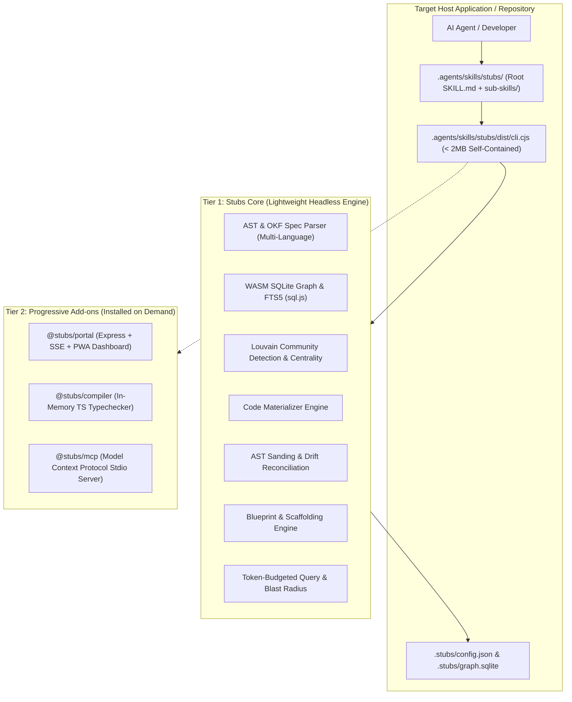

# Stubs Lite & Tiered Add-on Architecture Visual Diagram

```mermaid
graph TD
    subgraph HostProject["Target Host Application / Repository"]
        Agent[AI Agent / Developer]
        Config[".stubs/config.json & .stubs/graph.sqlite"]
        Skills[".agents/skills/stubs/ (Root SKILL.md + sub-skills/)"]
        CoreBin[".agents/skills/stubs/dist/cli.cjs (< 2MB Self-Contained)"]
    end

    subgraph Tier1["Tier 1: Stubs Core (Lightweight Headless Engine)"]
        Parser["AST & OKF Spec Parser (Multi-Language)"]
        Graph["WASM SQLite Graph & FTS5 (sql.js)"]
        Topology["Louvain Community Detection & Centrality"]
        Materializer["Code Materializer Engine"]
        Sander["AST Sanding & Drift Reconciliation"]
        Concept["Blueprint & Scaffolding Engine"]
        GraphRAG["Token-Budgeted Query & Blast Radius"]
    end

    subgraph Tier2["Tier 2: Progressive Add-ons (Installed on Demand)"]
        PortalAddon["@stubs/portal (Express + SSE + PWA Dashboard)"]
        CompilerAddon["@stubs/compiler (In-Memory TS Typechecker)"]
        McpAddon["@stubs/mcp (Model Context Protocol Stdio Server)"]
    end

    Agent --> Skills
    Skills --> CoreBin
    CoreBin --> Tier1
    Tier1 --> Config
    CoreBin -.->|"stubs add / ephemeral npx"| Tier2
```
